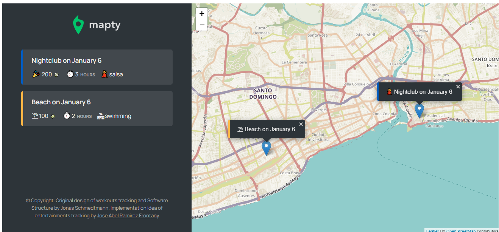

# Mapty

Project build with in vanilla JavaScript consisting of a website that connects to the geolocation API and by using the leaflet library display the map geolocated to your address. When you clicked on the map it shows a form to fill out the type of activity you perform in that location, the cost, the duration and the name of the activity you did there. Once you fill all the fields for that form and hit enter that activity is saved in the Browser local storage through the localstorage API and also is added to the HTML as a list being displayed below the form. Was build following the guide in the Udemy course "The Complete JavaScript Course 2021: From Zero to Expert!" created by Jonas Schmedtmann.

## Built With

- HTML
- CSS
- Javascript
- navigator API
- localstorage API
- Leaftlet

## Author

- 👤GitHub: [Jose Abel Ramirez](https://github.com/jose-Abel)

## Getting Started

You can clone this code anytime and load the HTML file on your browser. Since it was build with vanilla JavaScript and the bundle was already built, it doesn't need any other package.

## Live version

[live demo](https://ecstatic-poincare-317cbb.netlify.app/)

### Setup

You can either copy the code with git clone or just do a git pull on your local environment.

### Acknowledgments

Appreciate the teams at Udemy and the creator of the course Jonas Schmedtmann since allows me to learn a lot of JavaScript concepts and design principles that is pushing my software development career higher.

## 📝 License

This project is MIT licensed.

## Show your support

Give a ⭐️ if you like this project!
